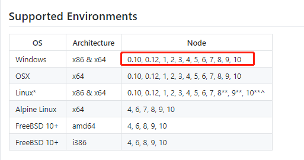
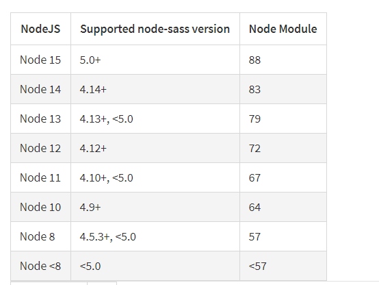

## 1、Node中间件-问题汇总

### 1、Node环境问题

#### 项目依赖 - **node-sass** - 与node版本不兼容

[node-sass](https://www.npmjs.com/package/node-sass)是一个项目依赖，在一个项目中在使用sass语法的时候，必须通过sass-loader来解析sass，从而使sass语法变成浏览器能够识别的CSS语法，而node-sass模块就是对sass-loader的支持模块，所以不安装node-sass，sass-loader就不能正常工作

**问题描述**：[链接](https://github.com/sass/node-sass/releases/tag/v4.9.0)

- windows x86的环境下，node-sass(v4.9.0)支持的node版本最高为10
- 用的node版本是v14.15.4，node-sass4.x无法支持高版本的node环境



**解决方法**

- （1）降低node版本：将node版本降为10及以下的版本即可；
- （2）升级node-sass版本为最新版本v5.0.0，最新版本的node-sass兼容低版本的node和高版本的node



```
app.46c1294c045ca5b02c0a.js:1126 Uncaught Error: Module build failed: ModuleBuildError: Module build failed: Error: Node Sass does not yet support your current environment: Windows 64-bit with Unsupported runtime (83)
For more information on which environments are supported please see:
https://github.com/sass/node-sass/releases/tag/v4.9.0
    at module.exports (E:\git\mobile\node_modules\node-sass\lib\binding.js:13:13)
    at Object.<anonymous> (E:\git\mobile\node_modules\node-sass\lib\index.js:14:35)
    at Module._compile (internal/modules/cjs/loader.js:1063:30)
    at Object.Module._extensions..js (internal/modules/cjs/loader.js:1092:10)
    at Module.load (internal/modules/cjs/loader.js:928:32)
    at Function.Module._load (internal/modules/cjs/loader.js:769:14)
    at Module.require (internal/modules/cjs/loader.js:952:19)
    at require (internal/modules/cjs/helpers.js:88:18)
    at Object.<anonymous> (E:\git\mobile\node_modules\sass-loader\lib\loader.js:3:14)
    at Module._compile (internal/modules/cjs/loader.js:1063:30)
    at Object.Module._extensions..js (internal/modules/cjs/loader.js:1092:10)
    at Module.load (internal/modules/cjs/loader.js:928:32)
    at Function.Module._load (internal/modules/cjs/loader.js:769:14)
    at Module.require (internal/modules/cjs/loader.js:952:19)
    at require (internal/modules/cjs/helpers.js:88:18)
    at loadLoader (E:\git\mobile\node_modules\loader-runner\lib\loadLoader.js:13:17)
    at E:\git\mobile\node_modules\webpack\lib\NormalModule.js:192:19
    at E:\git\mobile\node_modules\loader-runner\lib\LoaderRunner.js:364:11
    at E:\git\mobile\node_modules\loader-runner\lib\LoaderRunner.js:170:18
    at loadLoader (E:\git\mobile\node_modules\loader-runner\lib\loadLoader.js:27:11)
    at iteratePitchingLoaders (E:\git\mobile\node_modules\loader-runner\lib\LoaderRunner.js:169:2)
    at iteratePitchingLoaders (E:\git\mobile\node_modules\loader-runner\lib\LoaderRunner.js:165:10)
    at E:\git\mobile\node_modules\loader-runner\lib\LoaderRunner.js:173:18
    at loadLoader (E:\git\mobile\node_modules\loader-runner\lib\loadLoader.js:36:3)
    at iteratePitchingLoaders (E:\git\mobile\node_modules\loader-runner\lib\LoaderRunner.js:169:2)
    at runLoaders (E:\git\mobile\node_modules\loader-runner\lib\LoaderRunner.js:362:2)
    at NormalModule.doBuild (E:\git\mobile\node_modules\webpack\lib\NormalModule.js:179:3)
    at NormalModule.build (E:\git\mobile\node_modules\webpack\lib\NormalModule.js:268:15)
    at Compilation.buildModule (E:\git\mobile\node_modules\webpack\lib\Compilation.js:146:10)
    at E:\git\mobile\node_modules\webpack\lib\Compilation.js:433:9
    at E:\git\mobile\node_modules\webpack\lib\NormalModuleFactory.js:253:5
    at E:\git\mobile\node_modules\webpack\lib\NormalModuleFactory.js:99:14
    at Object.YQo6 (http://localhost:3000/js/app.46c1294c045ca5b02c0a.js:1:21147)
    at a (http://localhost:3000/js/manifest.43ec9a82edb6426921f5.js:1:101)
    at Object.NHnr (http://localhost:3000/js/app.46c1294c045ca5b02c0a.js:1:20573)
    at a (http://localhost:3000/js/manifest.43ec9a82edb6426921f5.js:1:101)
    at window.webpackJsonp (http://localhost:3000/js/manifest.43ec9a82edb6426921f5.js:1:418)
    at http://localhost:3000/js/app.46c1294c045ca5b02c0a.js:1:1
```

### 2、跨域
```js
// 3000端口
document.querySelector('#login').onclick = function() {
    const xhr = new XMLHttpRequest()
    xhr.open('post', 'http://localhost:8888/login', true)
    xhr.onload = () => {
    console.log(xhr.responseText);
    }
    xhr.send()
}
```


**解决方案**：[链接](/kkb/9-ajax/2-cors-jwt.html#_1、cors：跨域资源共享)

```js
// 8888端口
router.post('/login', async ctx => {
  ctx.set('Access-Control-Allow-Origin', '*')
  ctx.body = 'ok'
})
```

跨域解决方案汇总：
- 设置请求的服务响应头`Access-Control-Allow-Origin:*`
```js
ctx.set('Access-Control-Allow-Origin', '*')
```
- 通过node发送请求，node不存在cors问题
- 使用代理，比如koa-server-http-proxy
- webpack代理内置了node向服务器发送请求

### 3、403-Forbidden问题

- **403** - Forbidden

状态码 [403 Forbidden](https://developer.mozilla.org/zh-CN/docs/Web/HTTP/Status/403) 代表客户端错误，指的是服务器端有能力处理该请求，但是拒绝授权访问。


- 200
- 304
- 403
- 404
- 405 - Method Not Allowed

状态码 405 Method Not Allowed 表明服务器禁止了使用当前 HTTP 方法的请求。

- 501 - Not Implemented

HTTP 501 Not Implemented 服务器错误响应码表示请求的方法不被服务器支持，因此无法被处理。服务器必须支持的方法（即不会返回这个状态码的方法）只有 GET 和 HEAD。


### 生成验证码
插件`svg-captcha`
```js
const svgCaptcha = require('svg-captcha')
module.exports = async (ctx,next) => {
  // 生成验证码，挂载到session中
  try {
    const captcha = svgCaptcha.create()
    if(ctx.session) {
      ctx.session.imgCodeId = captcha.text.toLowerCase()
    }
    ctx.type = 'image/svg+xml'
    ctx.body = String(captcha.data)
    await next()
  } catch (err) {
    console.log(err);
  }
}
```
前端如何接收生成的二维码
```html
  <div id="img"></div>
  <script>
    const xhr = new XMLHttpRequest()
    xhr.open('get', '/api/captcha')
    xhr.onload = function() {
      const img = new Image()
      img.src = '/api/captcha'
      document.querySelector('#img').appendChild(img)
    }
    xhr.send()
  </script>
```

## 2、小程序


## 3、基于react的ssr

