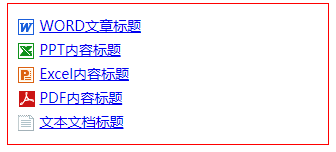
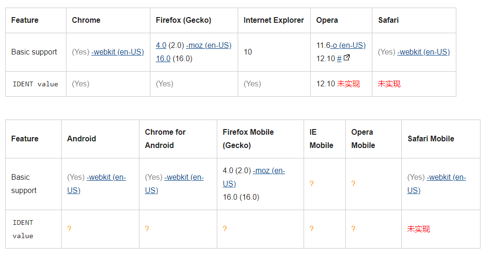

## 1、浏览器是怎样解析CSS选择器的？

1. `CSS`选择器的解析是**从右向左**解析的。
2. 若**从左向右**的匹配，发现不符合规则，需要进行回溯，会损失很多性能。
3. 若**从右向左**匹配，先找到所有的最右节点，对于每一个节点，向上寻找其父节点直到找到根元素或满足条件的匹配规则，则结束这个分支的遍历。

两种匹配规则的性能差别很大，是因为
- **从右向左**的匹配在第一步就筛选掉了**大量的不符合条件的最右节点**（叶子节点），
- 而**从左向右**的匹配规则的性能都浪费在了失败的查找上面。 

而在 `CSS` 解析完毕后，需要将解析的结果与 `DOM Tree`的内容一起进行分析建立一棵 `Render Tree`，最终用来进行绘图。

在建立`Render Tree` 时（`WebKit` 中的`「Attachment」`过程），浏览器就要为每个 `DOM Tree` 中的元素根据 `CSS` 的解析结果（`Style Rules`）来确定生成怎样的 `Render Tree`。


## 2、css sprites含义及使用
[css sprites与讲解实例](https://www.cnblogs.com/sharpest/p/6295137.html)
```html
<!DOCTYPE html>
<html lang="en">
<head>
  <meta charset="UTF-8">
  <meta http-equiv="X-UA-Compatible" content="IE=edge">
  <meta name="viewport" content="width=device-width, initial-scale=1.0">
  <title>Document</title>
  <style>
    ul.Sprites{ margin:0 auto; border:1px solid #F00; width:300px; padding:10px;} 
    ul.Sprites li{ height:24px; font-size:14px;line-height:24px; text-align:left; overflow:hidden} 
    ul.Sprites li span{ float:left; width:17px;padding-top:5px;height:17px;overflow:hidden;background:url(ico.png) no-repeat} 
    ul.Sprites li a{ padding-left:5px}

    /* 引入背景拼接好的图标素材图片:给span设置css背景图片 */
    ul.Sprites li span{ background: url(ico.png) no-repeat}

    /* 再分别对不同span class设置对于图标背景定位具体值 */
    /* 背景background-position有两个数值，前一个代表靠左距离值（可为正可为负），第二个数值代表靠上距离值（可为正可为负） */
    /* 设置背景图片作为对应盒子对象背景后向左“拖动”62px，向上“拖动”32px开始显示此背景图标 */    
    ul.Sprites li span.a1{ background-position: -62px -32px}
    ul.Sprites li span.a2{ background-position: -86px -32px}
    ul.Sprites li span.a3{ background-position: -110px -32px}
    ul.Sprites li span.a4{ background-position: -133px -32px}
    ul.Sprites li span.a5{ background-position: -158px -32px}
  </style>
</head>
<body>
  <ul class="Sprites"> 
    <li><span class="a1"></span><a href="#">WORD文章标题</a></li> 
    <li><span class="a2"></span><a href="#">PPT内容标题</a></li> 
    <li><span class="a3"></span><a href="#">Excel内容标题</a></li> 
    <li><span class="a4"></span><a href="#">PDF内容标题</a></li> 
    <li><span class="a5"></span><a href="#">文本文档标题</a></li> 
  </ul> 
</body>
</html>
```
|拼接图|页面效果图|
|:--:|:--:|
|||

`CSS Sprites`其实就是把网页中一些背景图片整合到一张图片文件中，再利用`CSS`的
- `“background-image”`，
- `“background- repeat”`，
- `“background-position”`

的组合进行背景定位，`background-position`可以用数字能精确的定位出背景图片的位置。

`CSS Sprites`为一些大型的网站节约了带宽，提高了用户的加载速度和用户体验，不需要加载更
多的图片。

## 3、CSS中link和@import的区别
[css link与import的区别是什么](https://www.php.cn/css-tutorial-470952.html)

- (1) `link`属于`HTML`标签，而`@import`是`CSS`提供的
- (2) 页面被加载的时，`link`会同时被加载，而`@import`被引用的`CSS`会等到引用它的 `CSS`文件被加载完再加载
- (3) `import`只在`IE5`以上才能识别，而`link`是`HTML`标签，无兼容问题
- (4) `link`方式的样式的权重高于`@import`的权重

## 4、src与href的区别

- `src`用于替换当前元素，`href`用于在当前文档和引用资源之间确立联系。

- `src`是`source`的缩写，指向外部资源的位置，指向的内容将会嵌入到文档中当前标签所在位置；在请求`src`资源时会将其指向的资源下载并应用到文档内，例如`js`脚本，`img`图片和`frame`等元素。`<script src =”js.js">`当浏览器解析到该元素时，会暂停其他资源的下载和处理，直到将该资源加载、编译、执行完毕，图片和框架等元素也如此，类似于将所指向资源嵌入当前标签内。这也是为什么将`js`脚本放在底部而不是头部。
```html
<!-- 资源下载并嵌入到文档中当前标签所在位置 -->

<script src="x.js"></script>
<iframe src="./a.html" iframeborder="0"></iframe>
```

- `href`是`Hypertext Reference`的缩写，指向网络资源所在位置，建立和当前元素（锚点）或当前文
档（链接）之间的链接，如果我们在文档中添加，那么浏览器会识别该文档为`css`文件，就会并行下载资源，并且不会停止对当前文档的处理。
```html
<!-- 下载并解析 -->
<link href="../css/index.css" />
<!-- 不会进行下载 -->
<a href="资源的链接"></a>
```

## 基础
**disabled 和 readonly 的区别？**
```
disabled 指当 input 元素加载时禁用此元素。input 内容不会随着表单提交。
readonly 规定输入字段为只读。input 内容会随着表单提交。
无论设置 readonly 还是 disabled，通过 js 脚本都能更改 input 的 value。
```

## css-transition
[css-transition](https://developer.mozilla.org/zh-CN/docs/Web/CSS/CSS_Transitions/Using_CSS_transitions)，提供一种修改css属性时控制动画速度的方法，让属性变化成为一个持续一段时间的过程，而不是立即生效。

[transition](https://developer.mozilla.org/zh-CN/docs/Web/CSS/transition)是以下属性的简写属性，
- `transition-property`指定应用过渡属性的名称，不具有继承性
- `transition-duration`属性以秒或毫秒为单位指定过渡动画所需的时间。默认值为 `0s` ，表示不出现过渡动画。
- `transition-timing-function`属性用来描述这个中间值是怎样计算的。实质上，通过这个函数会建立一条加速度曲线，因此在整个`transition`变化过程中，变化速度可以不断改变。
- `transition-delay`属性规定了在过渡效果开始作用之前需要等待的时间。
```css
/* Apply to 1 property */
/* property name | duration */
transition: margin-right 4s;

/* property name | duration | delay */
transition: margin-right 4s 1s;

/* property name | duration | timing function */
transition: margin-right 4s ease-in-out;

/* property name | duration | timing function | delay */
transition: margin-right 4s ease-in-out 1s;

/* Apply to 2 properties */
transition: margin-right 4s, color 1s;

/* Apply to all changed properties */
transition: all 0.5s ease-out;

/* Global values */
transition: inherit;
transition: initial;
transition: unset;

/* Keyword values */
transition-property: none; // 没有过渡动画
transition-property: all; // 所有可被动画的属性都表现出过渡动画。
transition-property: test_05; // 属性名称。由小写字母 a 到 z，数字 0 到 9，
                              // 下划线（_）和破折号（-）。第一个非破折号字符不能是数字。
                              // 同时，不能以两个破折号开头。
transition-property: -specific;
transition-property: sliding-vertically;

transition-property: test1;
transition-property: test1, animation4;
transition-property: all, height, all;
transition-property: all, -moz-specific, sliding;

/* Global values */
transition-property: inherit;
transition-property: initial;
transition-property: unset;


/* <time> 值 */
transition-duration: 6s;
transition-duration: 120ms;
transition-duration: 1s, 15s;
transition-duration: 10s, 30s, 230ms;

/* 全局值 */
transition-duration: inherit;
transition-duration: initial;
transition-duration: unset;

transition-timing-function: ease
transition-timing-function: ease-in
transition-timing-function: ease-out
transition-timing-function: ease-in-out
transition-timing-function: linear
transition-timing-function: cubic-bezier(0.1, 0.7, 1.0, 0.1)
transition-timing-function: step-start
transition-timing-function: step-end
transition-timing-function: steps(4, end)

transition-timing-function: ease, step-start, cubic-bezier(0.1, 0.7, 1.0, 0.1)

transition-timing-function: inherit

/* <time>?值 */
transition-delay: 3s;
transition-delay: 2s, 4ms;

/* 全局变量 */
transition-delay: inherit;
transition-delay: initial;
transition-delay: unset;
```

#### 浏览器兼容性
