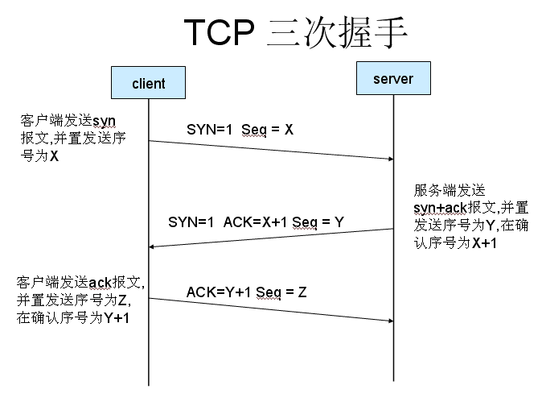

[前端宝典](https://www.nowcoder.com/tutorial/96/4700c6f1f3334c9191a38406002efa65)

### 要点

- [字节-前端一](https://leetcode-cn.com/circle/discuss/AjQ19D/)
- [字节-前端二](https://www.nowcoder.com/discuss/634244?source_id=discuss_experience_nctrack&channel=-1)
- [模拟面试](https://www.nowcoder.com/interview/ai/cover?companyTagId=665)
- [如何准备](https://www.zhihu.com/question/339135205)
- 项目总结
- [字节-算法](https://www.nowcoder.com/company/home/code/665)
- [字节-面经](https://www.nowcoder.com/discuss/tag/665?order=4&type=2&expTag=0&query=)

## 1、OSI七层协议

## 2、HTTP协议

[HTTP](https://developer.mozilla.org/zh-CN/docs/Web/HTTP)超文本传输​​协议，是一个用于传输超媒体文档（例如 HTML）的应用层协议。它是为 Web 浏览器与 Web 服务器之间的通信而设计的，但也可以用于其他目的。HTTP 遵循经典的客户端-服务端模型，客户端打开一个连接以发出请求，然后等待直到收到服务器端响应。HTTP 是无状态协议，这意味着服务器不会在两个请求之间保留任何数据（状态）。尽管通常基于 TCP/IP 层，但它可以在任何可靠的传输层上使用，也就是说，该协议不会像 UDP 那样静默的丢失消息。RUDP——作为 UDP 的可靠化升级版本——是一种合适的替代选择。

### HTTP概述

HTTP是一种能够获取如 HTML 这样的网络资源的 protocol(通讯协议)。它是在 Web 上进行数据交换的基础，是一种 client-server 协议，也就是说，请求通常是由像浏览器这样的接受方发起的。一个完整的Web文档通常是由不同的子文档拼接而成的，像是文本、布局描述、图片、视频、脚本等等。


### http常用请求头

### HTTP支持的方法

GET, POST, HEAD, OPTIONS, PUT, DELETE, TRACE, CONNECT

### GET和POST的区别

### 301和302的区别

### 状态码304和 200

### 常见的HTTP的头部

### cache-control的值有哪些

## 3、HTTP 和 HTTPS

## HTTP2.0 的特性

### (1) HTTP 和 HTTPS 的基本概念

- **HTTP**

[HTTP](https://www.cnblogs.com/TankXiao/archive/2012/02/13/2342672.html)是超文本传输协议，是互联网上应用最为广泛的一种网络协议，是一个客户端和服务器端进行数据请求和应答的标准（`TCP`），用于从 `WWW` 服务器传输超文本到本地浏览器的传输协议，它可以使浏览器更加高效，使网络传输减少。

- **https**

是以安全为目标的超文本传输协议，也就是`HTTP`的安全版本，即`HTTP`下加入`SSL`（安全套接字）层。`HTTPS`的安全基础是`SSL`，因此`HTTPS`的加密由`SSL`完成。`HTTPS`协议的主要作用是: **建立一个信息安全通道，来确保数据的传输，确保网站的真实性。**

### (2) HTTP 和 HTTPS 的区别？

`HTTP`传输的数据都是未加密的，也就是明文的，网景公司设置了`SSL`协议来对`HTTP`协议传输的数据进行加密处理，简单来说`HTTPS`协议是由`HTTP`和`SSL`协议构建的可进行加密传输和身份认证的网络协议，比`HTTP`协议的安全性更高。主要的区别如下：

- **`HTTPS`协议需要到`CA`申请证书，一般免费证书很少，需要交费。**
  - CA（Certificate Authority）证书颁发机构
  - 不同年限不同等级费用不一样，几千几万的都有
- **`HTTP`是超文本传输协议，信息是明文传输，`HTTPS`则是具有安全性的`SSL`加密传输协议。**
  - SSL(Secure Socket Layer)，安全套接字层
  - SSL可以使用非对称加密算法、对称加密算法、HASH算法
    - 非对称加密算法：RSA，DSA/DSS
    - 对称加密算法：AES，RC4，3DES
    - HASH算法： MD5，SHA1，SHA256
- **链接方式不同，端口也不同，`HTTP`协议的端口为`80`，`HTTPS`的端口为`443`。**
- `HTTP`的连接是简单的无状态的；`HTTPS`协议是由`SSL+HTTP`协议构建的可进行加密传输、身份认证的网络协议，比`HTTP`协议安全。

### (3) HTTPS 协议的工作原理

`HTTPS`在传输数据之前需要客户端（浏览器）与服务端（网站）之间进行一次握手，在握手过程中将确立双方加密传输数据的密码信息。`SSL`协议一套加密传输的协议，使用了非对称加密，对称加密以及`HASH`算法。握手过程的具体描述如下：


- **1.客户端（浏览器）将自己支持的一套加密规则发送给服务端（网站）**，开始进行 `HTTPS` 请求。
- **2.网站从中选出一组加密算法与`HASH`算法，并将自己的身份信息以证书的形式发回给浏览器**。证书里面包含了网站地址，加密公钥，以及证书的`CA`（颁发机构）等信息。
- **3.浏览器获得网站证书**之后要做以下工作：
  - **验证证书的合法性**（颁发证书的机构是否合法，证书中包含的网站地址是否与正在访问的地址一致等），如果证书受信任，则浏览器地址栏前面会显示一个小锁头，否则会给出证书不受信的提示。
  - 如果证书受信任，或者是用户接受了不受信的证书，**浏览器会生成一串随机数的密码，并用证书中提供的公钥加密**。
  - 使用约定好的`HASH`算法**计算握手消息**，并使用生成的随机数**对消息进行加密**，最后将之前生成的所有信息发送给网站。
- **4.网站接收浏览器发来的数据**之后要做以下的操作：
  - 使用自己的**私钥**将信息解密取出**密码**，使用密码解密浏览器发来的**握手消息**，并验证`HASH`是否与浏览器发来的一致。
  - 使**用密码加密一段握手消息**，发送给浏览器。
- **5.浏览器解密并计算握手消息的`HASH`**，如果与服务端发来的`HASH`一致，此时握手过程结束，之后所有的通信数据将由之前浏览器生成的随机密码并利用对称加密算法进行加密。


### (4) https协议的优点

- 使用HTTPS协议可认证用户和服务器，确保数据发送到正确的客户机和服务器；
- HTTPS协议是由SSL+HTTP协议构建的可进行加密传输、身份认证的网络协议，要比http协议安全，可防止数据在传输过程中不被窃取、改变，确保数据的完整性。
- HTTPS是现行架构下最安全的解决方案，虽然不是绝对安全，但它大幅增加黑客攻击的难度。
- 谷歌曾在2014年8月份调整搜索引擎算法，并称“比起同等HTTP网站，采用HTTPS加密的网站在搜索结果中的排名将会更高”

### (5) https协议的缺点
- https握手阶段比较费时，会使页面加载时间延长50%，增加10%~20%的耗电。
- https缓存不如http高效，会增加数据开销。
- SSL证书也需要钱，功能越强大的证书费用越高。
- SSL证书需要绑定IP，不能在同一个ip上绑定多个域名，ipv4资源支持不了这种消耗。

## 3、TCP三次握手，四次挥手

### 为什么需要“三次握手”

`client`发出的第一个连接请求报文段并没有丢失，而是在某个网络结点长时间的滞留了，以致延误到连接释放以后的某个时间才到达`server`。本来这是一个早已失效的报文段。但`server`收到此失效的连接请求报文段后，就误认为是`client`再次发出的一个新的连接请求。于是就向`client`发出确认报文段，同意建立连接。假设不采用“三次握手”，那么只要`server`发出确认，新的连接就建立了。(谢希仁版《计算机网络》)

由于现在`client`并没有发出建立连接的请求，因此不会理睬`server`的确认，也不会向`server`发送数据。但`server`却以为新的运输连接已经建立，并一直等待`client`发来数据。这样，`server`的很多资源就白白浪费掉了。

采用“三次握手”的办法可以防止上述现象发生。例如刚才那种情况，client不会向server的确认发出确认。server由于收不到确认，就知道client并没有要求建立连接。


### 三次握手的目的
- 实现可靠的数据传输
- 防止**已失效的连接请求报文段**突然又传送到了服务端，因而产生错误。
- 解决**网络中存在延迟的重复分组**的问题。
- 防止`server`端一直等待，浪费资源。

### TCP - 建立连接协议（三次握手）

TCP是传输控制协议，用于建立通信连接，是客户端和服务端之间进行通信的桥梁。

TCP协议的通信双方，都必须维护一个序列号，以标识发送出去的数据包中，哪些是已经被对方收到的。

三次握手的过程即是通信双方相互告知序列号起始值，并确认对方已经收到了序列号起始值的必经步骤。



- （1）第一次握手，客户端发送一个连接标识码`SYN=1`，随机序号`Seq=X`的数据包给服务端。服务端由`SYN=1`得知，客户端要求建立连接。
  - `SYN = 1（建立连接）, Seq = x （随机序号1~7）`
- （2）第二次握手，服务端收到请求后，要确认连接信息，向客户端发送确认码为`ACK = X + 1`（客户端的序号Seq+1），连接标识码、随机序号`Seq = Y`的数据包。
  - `SYN = 1, ACK = X + 1, Seq = Y `
  - 它表示对刚才客户端SYN报文的回应；
  - 同时又标志SYN给客户端，询问客户端是否准备好进行数据通讯。
- （3）第三次握手，客户端检验随机码、连接标识码、确认码，通过后，再次向服务端发送的确认码`ACK=Y+1`、随机序号`Seq = Z`的数据包。 服务端收到数据包后进行确认，则连接建立成功。
  - `ACK = Y + 1, Seq = Z `

### 说明
- Seq：表示客户端，数据包的数据部分的第一位应该在数据流中所占的位置。下一个实际有数据的传输，会从上一次发送的ACK数据包的Seq开始。
- ACK：表示期望的接收方的下一次Seq是多少

```bash
# syn - sync 同步
# Seq - sequence 序列号
# ACK - acknowledge 应答；确认帧
```

## 4、TCP 和 UDP 的区别
- （1）TCP是面向连接的，UDP是无连接的，即发送数据前不需要先建立链接。
- （2）TCP提供可靠的服务。也就是说，通过TCP连接传送的数据，无差错，不丢失，不重复，且按序到达；UDP尽最大努力交付，即不保证可靠交付。 并且因为TCP可靠，面向连接，不会丢失数据因此适合大数据量的交换。
- （3）TCP是面向字节流，UDP面向报文，并且网络出现拥塞不会使得发送速率降低（因此会出现丢包，对实时的应用比如IP电话和视频会议等）。
- （4）TCP只能是1对1的，UDP支持1对1,1对多。
- （5）TCP的首部较大为20字节，而UDP只有8字节。
- （6）TCP是面向连接的可靠性传输，而UDP是不可靠的。


## http1.0和http2.0

## 5、传输安全问题

## 6、数据请求方式

[数据请求方式](https://www.cnblogs.com/skynet/archive/2010/05/18/1738301.html)

## 7、跨域

## 8、http缓存策略

## 浏览器缓存

缓存分为两种：强缓存和协商缓存，根据服务端的响应头内容来决定。


### 强缓存
强缓存相关字段有expires，cache-control。如果cache-control与expires同时存在的话，cache-control的优先级高于expires。

### 协商缓存
协商缓存相关字段有Last-Modified/If-Modified-Since，Etag/If-None-Match

### 301和302的区别

301 Moved Permanently 被请求的资源已永久移动到新位置，并且将来任何对此资源的引用都应该使用本响应返回的若干个URI之一。如果可能，拥有链接编辑功能的客户端应当自动把请求的地址修改为从服务器反馈回来的地址。除非额外指定，否则这个响应也是可缓存的。
302 Found 请求的资源现在临时从不同的URI响应请求。由于这样的重定向是临时的，客户端应当继续向原有地址发送以后的请求。只有在Cache-Control或Expires中进行了指定的情况下，这个响应才是可缓存的。

字面上的区别就是301是永久重定向，而302是临时重定向。

301比较常用的场景是使用域名跳转。302用来做临时跳转 比如未登陆的用户访问用户中心重定向到登录页面。

### 状态码304和200


## 前端优化

- **降低请求量**：合并资源，减少HTTP 请求数，minify / gzip 压缩，webP，lazyLoad。
- **加快请求速度**：预解析DNS，减少域名数，并行加载，CDN 分发。
- **缓存**：HTTP 协议缓存请求，离线缓存 manifest，离线数据缓存localStorage。
- **渲染**：JS/CSS优化，加载顺序，服务端渲染，pipeline，重绘和回流，防抖和节流。


